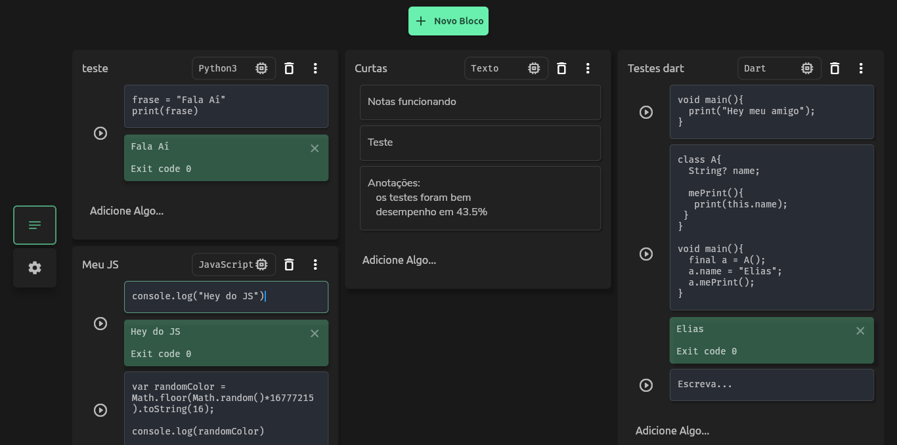

# 

 <h2 align="center">Guma Notes</h2>
  
  
 <h4 align="center">
  

  
Guma is a flutter program capable of saving notes and executing blocks of code.</h4>
  

### Download and Open Guma Folder
  
  after you have installed the Flutter SDK...

    git clone https://github.com/Mastercliff/guma.git

    cd guma

#

### Enable Flutter for Linux

    flutter config --enable-linux-desktop

### Run

    flutter run --no-sound-null-safety

 > * use --no-sound because some dependencies have not migrated to null-safety